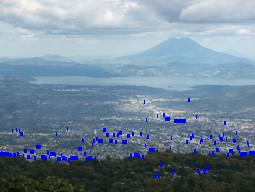
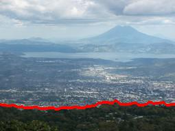

## **PART 1: IJK**

IJK is a sliding tile game played on a 6x6 board by two players (either human or ai). First player is denoted by &#39;+&#39; and second player is denoted by &#39;-&#39;. To make the AI smart, **minimax algorithm with alpha-beta pruning** is implemented with a depth of 3.

Successors are possible for all four moves, that is UP, DOWN, LEFT and RIGHT, and each successor is expanded in minimax function until terminal state is obtained or the final depth is reached. Alpha-beta pruning is used to avoid visiting unnecessary nodes further saving the computation time for the utility value of a branch. For each successor the current state gets a calculated utility value and using this value the best possible move is made.

**Utility value** is calculated based on current successor state, where the total sum is taken of multiplication of each cell value by the corresponding cell value of the weight matrix. To this sum a weighted value of empty tiles for that successor state is also added, giving the final utility value that is returned.

Now, each character in current board is converted into integer based on &#39; **transformplus&#39;** (when first player is AI) and &#39; **transformminus&#39;** (when second player is AI)  dictionaries. The current AI&#39;s characters have positive value and opponent&#39;s characters will have negative value.

The values of these dictionaries are as follows:

**transformplus** = {&#39;a&#39;: -2, &#39;b&#39;: -4, &#39;c&#39;: -8, &#39;d&#39;: -16, &#39;e&#39;: -32, &#39;f&#39;: -64, &#39;g&#39;: -128, &#39;h&#39;: -256, &#39;i&#39;: -512, &#39;j&#39;: -1024, &#39;k&#39;: -2048, &#39;A&#39;: 2, &#39;B&#39;: 4, &#39;C&#39;: 8, &#39;D&#39;: 16, &#39;E&#39;: 32, &#39;F&#39;: 64, &#39;G&#39;: 128, &#39;H&#39;: 256, &#39;I&#39;: 512, &#39;J&#39;: 1024, &#39;K&#39;: 2048}

**transformminus** = {&#39;a&#39;: 2, &#39;b&#39;: 4, &#39;c&#39;: 8, &#39;d&#39;: 16, &#39;e&#39;: 32, &#39;f&#39;: 64, &#39;g&#39;: 128, &#39;h&#39;: 256, &#39;i&#39;: 512, &#39;j&#39;: 1024, &#39;k&#39;: 2048, &#39;A&#39;: -2, &#39;B&#39;: -4, &#39;C&#39;: -8, &#39;D&#39;: -16, &#39;E&#39;: -32, &#39;F&#39;: -64, &#39;G&#39;: -128, &#39;H&#39;: -256, &#39;I&#39;: -512, &#39;J&#39;: -1024, &#39;K&#39;: -2048}

The weight matrix used to calculate the utility value is given below:

**weightMatrix** = [

[2048, 1024, 512, 256, 128, 64],

[1024, 512, 256, 128, 64, 32],

[512, 256, 128, 64, 32, 16],

[256, 128, 64, 32, 16, 8],

[128, 64, 32, 16, 8, 4],

 [64, 32, 16, 8, 4, 2]

 ]

The weight matrix is selected in such a way that it has highest values concentrated in upper left corner, as which will help the AI to concentrate higher character value to be at upper left corner. This arrangement of having the highest tile concentrated in one corner makes it easier to combine other tiles in the board.

Number of empty tiles is also used to calculate the utility value, where for each empty tile, **(2048)****4**and this value was considered to have the empty tiles value comparable with the calculated weight value.

Thus, utility value is sum of the calculated weight value and the value of the empty tile, and this value is used by the minimax algorithm to maximize the chances of AI to win. Four utility values are obtained for the four moves possible from current state and the move with highest utility value is carried out as next move for AI.

Functions used in the code:

**weight() :** To calculate the weight value and the empty tiles value.

**convert()** : To convert the current board with characters into corresponding integers.

**utility() :** To calculate the successor&#39;s utility value.

**successor():** To get the successor of given state.

**miminmax():** Function that implements minimax algorithm with alpha-beta pruning for current state of the game.

**next\_move():** Given function where the AI code is implemented and the decision regarding next move is made.

**Heuristics:**

Perhaps the majority of our time went out it is trying different heuristics, formulating them, researching them online and testing how the affected our AI algorithm with the latter part being quite tough. We considered the following heuristics:

1) **The snake-shaped heuristic**

[Referenced from: [http://cs229.stanford.edu/proj2016/report/NieHouAn-AIPlays2048-report.pdf](http://cs229.stanford.edu/proj2016/report/NieHouAn-AIPlays2048-report.pdf)
AI Plays 2048: _by Yun Nie (yunn), Wenqi Hou (wenqihou), Yicheng An (yicheng)]_

This heuristic seemed like a very good choice since it focused on getting larger values at one edge of the board which seems intuitive. But when we implemented the same with the powers of 2 the output was not promising. Our AI lost to the random AI half the times in 10 trials.

2) **The gradient heuristic**

Learning a bit from the above heuristic we tried converting the weighted matrix from above to a gradient matrix where a randomly picked corner would have the highest value and it gradually decreased to the opposite corner. We let the starting corner be of weight 2048 and it got halved on every both way with an opposite corner being 2. This gave us good results.

3) **The number of empty tiles**

[Referenced from: [https://stackoverflow.com/questions/22342854/what-is-the-optimal-algorithm-for-the-game-2048](https://stackoverflow.com/questions/22342854/what-is-the-optimal-algorithm-for-the-game-2048) answered by Petr Morávek (@xificurk)]

We thought of adding the number of tiles empty as a reward or giving a penalty for each tile being occupied. After trials, we ended up with rewarding the heuristic with a fixed value in the power of 2048 for every empty tile. We added a big weight here so as to push the algorithm towards merging as many tiles as possible.

4) **Monotonicity:**

Same reference as above.

We looked into making our matrix monotonic since this promoted the merging of tiles or increasing the likelihood of it. We weren&#39;t able to reach a conclusion of how this would factor in a two-player game since our Ai should not be helping the opponent. We didn&#39;t try to implement this heuristic.

5) **Adjacent tiles:**

We tried creating a penalty function that would try to push the algorithm to make the board a bit monotonic not entirely. The penalty function in our code (later we commented it out) tried to give a higher penalty for the bigger difference in sizes of adjacent tiles. So, if the tiles that are the same value are side by side this function gave no penalty, then for each step difference it gave more penalty. It was not so effective so ee didn&#39;t include it in our final algorithm.

**Final:**

While testing we found that a combination of two heuristics worked well together: The number of empty tiles and Gradient weights. We could find a scale of both that was compatible and gave us 13 wins out of 15 vs the random Ai.

## **PART 2: Horizon Finding**

A classic problem in computer vision is to identify where on Earth a photo was taken using visual features alone (e.g., not using GPS). One way of trying to geolocate such photos is by extracting the horizon (the boundary between the sky and the mountains) and using this as a fingerprint that can be matched with a digital elevation map to identify where the photo was taken.

#### A description of how you formulated each problem:

This problem has 3 sub parts to work on. The initial code given, loads the image, calculates the edge strength map and draws a straight line in the middle of the image. Based on the formula and the explanation given in the instruction, the first part of the problem was solved using the <i>argmax</i> function of NumPy which gets the maximum edge strength from each column and returns a row. While this was a simple and a one liner solution, the results were pretty bad. Thus, we move on to the next part of the problem where we are suggested to use Hidden Markov Model and use Viterbi algorithm to solve the Maximum a Posterior estimate. For Viterbi we require 3 elements: state probabilities, transition probabilities and emission probabilities. Now mountains are not straight, so it is important to detect whether the ridge is moving upwards or downwards. What we’ve done is that while traversing through the columns, we take 5 pixels of the next column (one in the same row, and 2 above and below this pixel) and check for the state which has the maximum probability. Transition probabilities are assigned logically based based on these 5 pixels.We expect the ridge to mostly go forward or a pixel above or below as we go from column to column . The one beside the current state gets the highest probability, the states one above and below this state are assigned a lower probability and the states two above and below the state are assigned the least probabilities. Implementing this logic with Viterbi algorithm did produced results better than the previous part however, but only for the images in which the horizon was clear. Hence, to solve this issue we move to the third part of the problem where we give human input in the form of coordinates, i.e. a point on the ridge. As the instruction suggested that we do not change the implementation of the algorithm, we can just feed the input in our implementation. What we’ve done for this part is that once we get the human input, we get the maximum states from each column in both directions from the given column. This implementation provided the best results in detecting the horizon.

#### A brief description of how your program works:

As the problem is divided in 3 parts our implementation of the code has also 3 parts The first part, as discussed above uses argmax function of the NumPy library to find the maximum edge strength from each column and returns a row. The program for the second part involves Hidden Markov Model solved using the Viterbi algorithm. The code traverses through each column and checks 5 consecutive states in the next column to find the next most probable state. This is done by calculating the max of 5 products of previous state probabilities into the transition probabilities from the previous state to the current state. Our code works in a dynamic programming way where we store the maximum row number of the previous column so we can use it as a lookup table when we back track.The program for the third part is similar to the previous part with additional input from the human. The user gives a coordinate on the ridge which is fed into the Viterbi algorithm and performs a bidirectional search from the given column to find the most probable states and return a row. The human input works with the ripple effect as the probabilities propagate through the pixels and we can see a much better output accuracy. While factoring in the human input, we set the value of the particular pixel as 1 probability and 0 for other states in that column.

#### Discussion of any problems you faced, any assumptions, simplifications, and/or design decisions you made:

One of the main design decisions we had to make was to decide the transition probabilities as the instructions mentioned that there are no right answers for that. Hence, we logically decided that when going from column to other the ridge will only move a pixel above, below(probability 0.2545) or stay in the same row with the highest chance it stays of 0.5. We gave a minute chance for the ridge to skip a pixel and jump to two rows above or below the current row when going from column to column(0.005). We assumed that the transition probabilities from far away states is 0 since ridge jumping should not happen. After handling the transition probabilities we needed starting probabilities of each row, which we assumed to be the edge strength for that pixel divided by the total edge strength of the column as to main the sum or entire column as 1. We tried a couple of possible solutions here as giving equal starting probabilities to each pixel in the column (1/number of rows) or just the edge strength but found this works the best. We assumed emission probabilities as the edge strength values for each pixel. We did not divide it with total edge strength of the column this time since all we needed the values were for comparing and the denominator could be ignored since it would be constant among all the probabilities that would be compared. This avoided the underflow error we would have gotten if we divided it with a huge number. To avoid the overflow error now we divided the emission probabilities with 100. In the Human input, we initially tried only moving the effect forwards since it was intuitive but when we moved the effect backward too, the ridge was much more accurate. 

### The example outputs:
#### Using Bayes Net:

#### Using Viterbi:

#### Adding Human Feedback of (row=76, col=127) to Viterbi:

